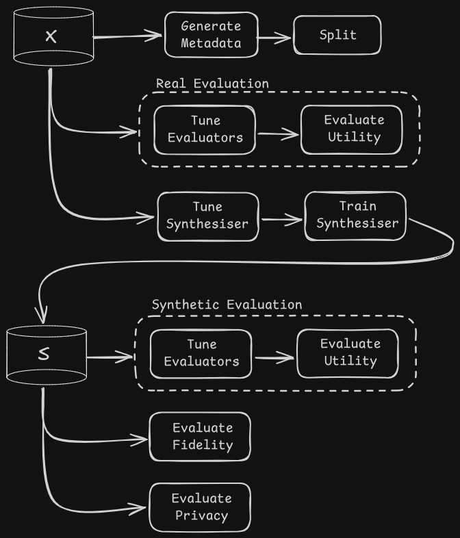
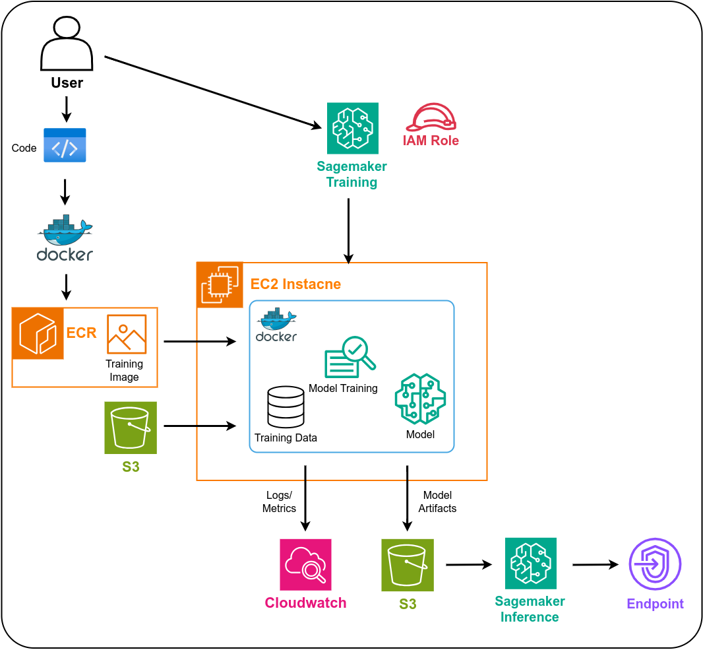

# Synthetic Tabular Data Generation Pipeline

A robust Python architecture designed to generate high-quality synthetic tabular data and perform rigorous evaluation. This pipeline supports multiple generative models (CTGAN, Binary Diffusion, TVAE) and offers flexible execution across local environments and AWS SageMaker.

## Features

* **Multi-Model Support:** Easily switch models: CTGAN, TVAE, Gaussian Copula, Copula GAN, Binary Diffusion, and POTNet.
* **Evaluation Suite:** Automatically compares synthetic data against real datasets.
* **Scalable Architecture:** Run lightweight experiments locally or scale to the cloud using AWS SageMaker and Docker.
* **Experiment Tracking:** Built-in integration with Weights & Biases and Optuna.

## Pipeline Architecture



## Evaluation Metrics

The pipeline automatically assess synthetic data quality across three pillars:

1. **Fidelity:** Measures statistical similarity between real and synthetic data via the Wasserstein distance. For datasets with mixed data types, gowers distance is used as the ground cost matrix.

2. **Utility:** Measures how synthetic data performs compared to real data on downstream ML tasks following the "Train-on-Synthetic, Test-on-Real" (TSTR) strategy. Four different ML evaluators are used for Regression or Classification. 

3. **Privacy:** Measures empirical exposure risk via the Membership Disclosure Score (MDS).

## Quick Start (Local Execution)

Get the pipeline running on your machine in minutes.

### 1. Setup Environment

```bash
# Clone the repo
git clone https://github.com/ChadSims/SDG-AWS-SageMaker.git
cd SDG-AWS-SageMaker

# Create and activate virtual environment
python -m venv .venv
source .venv/bin/activate  # Windows: .venv\Scripts\activate

# Install dependencies
pip install -r requirements.txt
```

### 2. Configuration

Create a `.env` file in the root directory:

```env
PYTHONPATH="."
WANDB_API_KEY=your_api_key_here
```

*Note: Ensure your dataset is placed at `datasets/{dataset_name}/{dataset_name}.csv`.*

### 3. Run Your First Pipeline

```bash
python run_pipeline_local.py --dataset abalone --target_column Rings --model ctgan
```

### Pro-Tips & Troubleshooting

* **Import Errors:** If you encounter `ModuleNotFoundError`, ensure your `PYTHONPATH` is set:
`export PYTHONPATH=$PYTHONPATH:$(pwd)`
* **GPU Memory:** If running Binary Diffusion on a smaller GPU, adjust `BD_TRIALS` and `BD_TUNE_STEPS` and run trials sequentially using `tune_synthesiser.py`.
* **Workflow Optimisation:** When testing a different model on a dataset you've already processed, you can comment out the "Dataset Setup" and "Evaluate on Real" sections in `run_pipeline_local.py` to save time.

## AWS SageMaker Deployment

The cloud pipeline uses Amazon SageMaker for scalable training and evaluation, leveraging Docker containers for environment consistency.

### Prerequisites

* AWS CLI configured with appropriate permissions.
* Docker installed locally.

### 1. IAM & Permissions

Ensure your AWS user/role has the following managed policies:

- `AmazonSageMakerFullAccess`
    
- `AmazonEC2ContainerRegistryFullAccess`
    
- `AmazonS3FullAccess`


> **Note:** For production, it is best practice to use an **IAM Role** with a custom trust policy specifically for SageMaker execution.

### 2. S3 Bucket Structure

The pipeline expects a specific organisational structure in your S3 bucket to avoid pathing errors. Create a bucket (e.g., `sagemaker-sdg-pipeline`) with the following layout:

```text
s3://your-bucket-name/
├── datasets/
│   └── abalone/           # Dataset name folder
│       └── abalone.csv    # Raw data
└── output/                # Destination for synthetic data & logs
```

### 3. Containerisation (ECR)

The pipeline runs inside a Docker container to ensure all dependencies (like specific PyTorch versions for your models) are identical to your local environment.

1. **Configure CLI:** `aws configure` (Ensure region matches `.aws/config` and add credentials to `./aws/credentials`).

2. **Build & Push:**
    
    ```bash
    chmod +x build.sh push_to_ecr.sh
    ./build.sh          # Builds local image 'sdg-sagemaker'
    ./push_to_ecr.sh    # Authenticates Docker to ECR and pushes image
    ```
    
3. **Verify:** Check the AWS Console under **Elastic Container Registry** to ensure your image URI is available.

### 4. Local Orchestration Setup

Now that the image is pushed, you need to prepare your local environment to "talk" to AWS and run the launch notebook:

1. **Modify Requirements:** Open `requirements.txt` and uncomment the section: `# Required to run container on AWS / in local environment`, and comment out `# required inside container/ for pipeline` (if you don't plan to run the pipeline locally)
    
2. **Sync Local Environment:**
    
    ```bash
    pip install -r requirements.txt
    ```
    
    _This installs `sagemaker`,   `ipykernel`, etc. locally._

### 5. Launching Training Job

Open `training_job.ipynb` in your local environment or SageMaker Studio and update the configuration cell:

- `bucket`: The name of your S3 bucket.
    
- `image`: The full ECR Image URI (e.g., `1234567890.dkr.ecr.us-east-1.amazonaws.com/sdg-sagemaker:latest`).
    
- `role`: The ARN of your SageMaker execution role.
    
### Important Cloud Considerations

> [!WARNING] 
> **Costs & Cleanup:** AWS instances (e.g., `ml.g4dn.2xlarge`) incur hourly charges. Monitor your **SageMaker Training Jobs** console to ensure sessions terminate correctly.

- **Region Consistency:** Your **S3 Bucket**, **ECR Repo**, and **SageMaker Job** must reside in the same region.
    
- **Monitoring:** Use **CloudWatch Logs** to debug container failures.

### AWS Cleanup

To avoid recurring storage and compute charges, perform these steps after your experiments:

- **Stop Notebooks:** If using SageMaker Studio or Notebook Instances, ensure they are **Stopped**.
    
- **Delete ECR Images:** ECR charges for image storage. Delete unused images via the ECR console.
    
- **Empty S3:** Delete the `output/` folder in your S3 bucket if the data is no longer needed.

### AWS Architecture Diagram



## Monitoring & Results

### Weights & Biases

The pipeline logs all metrics to W&B. You can view Parallel Coordinate plots and training curves directly in your dashboard.

### Hyperparameter Optimisation (Optuna)

Visualise your tuning results using the Optuna Dashboard:

```bash
# For sequential trials
optuna-dashboard sqlite:///optuna_study.db

# For parallel trials
optuna-dashboard ./path/to/journal.log
```


## Project Structure

```text
├── datasets/             # Local data storage.
├── exp/                  # Experiment results, saved model files, and synthetic data samples. 
├── lib/                  # Core logic.
├── params/               # Stores ML and generative model hyperparameters.
├── scripts/              # Helper and processing scripts
├── synthesisers/         # Generative model wrappers.
├── run_pipeline_local.py # Main entry point for local runs.
├── run_pipeline.py       # Main entry point for cloud runs.
├── training_job.ipynb    # AWS SageMaker entry point/ Launch training job.
└── Dockerfile            # Container definition for cloud runs.
```


## Acknowledgements

- [SynMeter](https://github.com/zealscott/SynMeter)

- [SDV (Synthetic Data Vault)](https://datacebo.com/sdv-dev/)

- [Binary Diffusion Tabular](https://github.com/vkinakh/binary-diffusion-tabular)

- [POTNet](https://github.com/sophial05/POTNet)